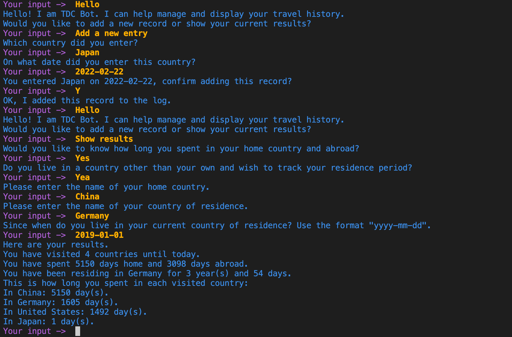

# TDC-Bot

## Intro
* **TDC(Travel Day Counter)-Bot** is a simple chatbot that helps track your visited countries

## Dependencies
* `pandas`
* `spacy`

## Set-up
* Install `rasa` and `rasa-sdk`
```
pip install rasa==2.8.8 rasa-sdk==2.8.2
```
* Install the required dependencies
* Download the pre-trained spaCy model for English
```
python -m spacy download en_core_web_md
```
* Switch to the project directory
* In one terminal window, enable the local action server
```
rasa run actions
```
* In a separate window, run the trained rasa model
```
rasa shell
```
* Now you can talk to TDC-Bot. It has two basic functions:

    * adding a new entry: you can tell TDC-Bot when you visit a new country
    * showing the current results: TDC-Bot shows how long you spent in each country

## Demo
* The following screenshot demonstrates the functionality of TDC-Bot


